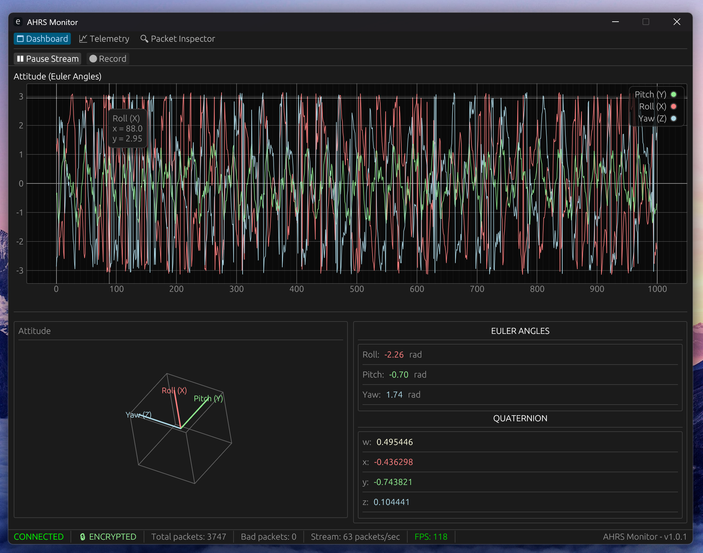
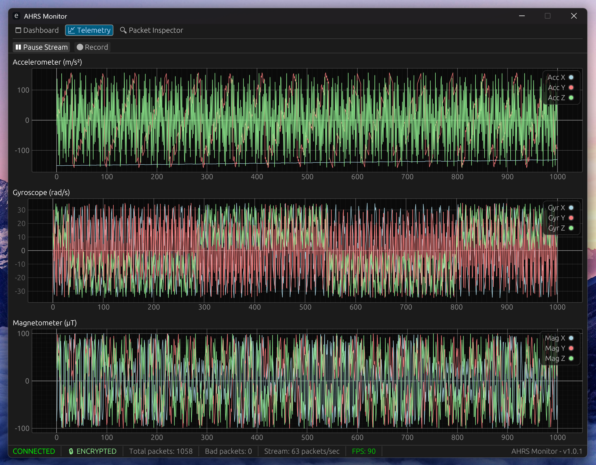
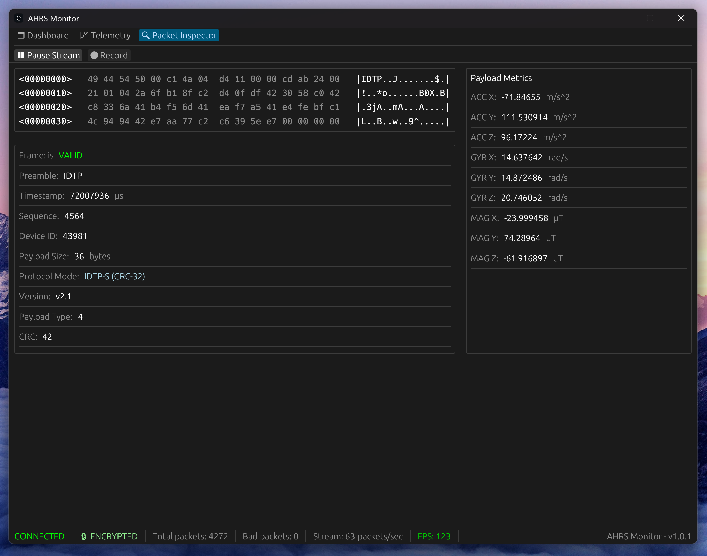

# AHRS Monitor

[](https://opensource.org/license/apache-2-0)


## Overview

AHRS Monitor is a desktop application for real-time monitoring, visualization, and logging of inertial measurement unit (**IMU**) data transmitted via the [`IDTP (IMU Data Transfer Protocol)`](https://github.com/alkuzin/idtp).

It provides engineers and researchers with a toolkit for debugging, validating, and analyzing IMU sensor streams from autonomous navigation systems.

The monitor receives encrypted UDP streams, validates data integrity, and presents attitude estimation results with minimal latency.

> This project is developed for academic purposes as part of a Bachelor's thesis.

## 🚀 Key Features

- **Real-Time 3D Visualization**: Smooth cube model rotation using hardware-accelerated egui.
- **IDTP Protocol Support**: Native parsing of `IDTP v2` with support for all standard payloads.
- **Telemetry Logging**: High-speed CSV logging.
- **Attitude Estimation**: The system integrates an external **Madgwick filter** implementation, driven by a **specialized pre-processing engine**. This engine extracts microsecond-accurate hardware timestamps from the IDTP stream to provide precise, non-deterministic *dt* values to the filter, significantly reducing integration drift.
- **Cross-Platform**: Runs on **Windows** & **Linux**.

## 🖥️ Interface Modules

- **Dashboard**: Real-time 3D attitude indicator. It synchronizes integrated sensor fusion data with a hardware-accelerated cube model, providing an immediate visual representation of the IMU's orientation (*Roll,Pitch,Yaw*).



---

- **Telemetry**: A dedicated diagnostic suite for signal analysis. It provides multi-channel live graphing of raw sensors data, allowing for the visual identification of sensor noise & vibration profiles.



---

- **Packet Inspector**: A low-level protocol debugger for the IDTP stack. It offers a real-time stream of incoming binary frames, displaying raw hex data alongside parsed header metadata & payload contents. Essential for verifying HMAC signatures & CRC integrity.



## 🚦 Getting Started

1) **Edit monitor configurations:** Configurations are located in [`ahrs-monitor/configs/config.toml`](ahrs-monitor/configs/config.toml)

2) **Generate keys & firmware config module:**

```shell
cargo keygen
```

This updates `configs/secrets/` and ensures both the AHRS Monitor and firmware are synchronized.

3) **Build & run AHRS Monitor:**

```shell
cargo monitor
```

4) **Simulation (Optional):**

If you don't have a hardware IMU connected, use the built-in simulator:

```shell
cargo simulator
```

## 🔒 Security & Integrity

The monitor implements a build-time security model. Cryptographic keys are embedded into the firmware binary using `include_bytes!`.

- **HMAC-SHA256**: Ensures that telemetry data originates from your specific hardware.
- **CRC-32-AUTOSAR**: Detects bit-flips and transmission errors over Wi-Fi.
- **Replay Protection**: Validates hardware timestamps to prevent data spoofing.

## 📜 License

Copyright (C) 2026-present ahrs-monitor project and contributors.

Licensed under the Apache License, Version 2.0 (the "License");
you may not use this file except in compliance with the License.
You may obtain a copy of the License at

http://www.apache.org/licenses/LICENSE-2.0

Unless required by applicable law or agreed to in writing, software
distributed under the License is distributed on an "AS IS" BASIS,
WITHOUT WARRANTIES OR CONDITIONS OF ANY KIND, either express or implied.
See the License for the specific language governing permissions and
limitations under the License.
